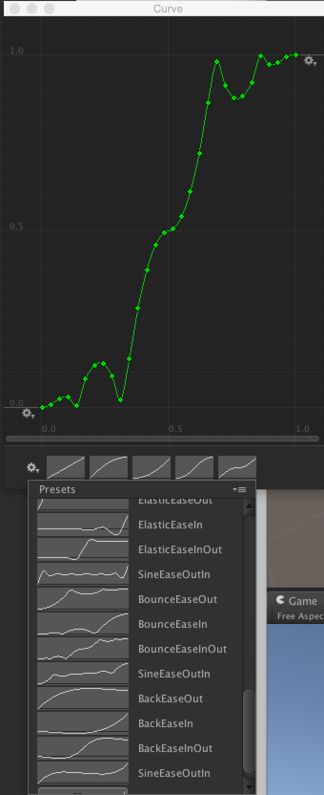

EasingCurvePresets
==================

The generated AnimationCurve presets from Penner's easing functions.

Usage
-----

Download [the .curves file](https://raw.githubusercontent.com/nobutaka/EasingCurvePresets/master/Assets/Editor/EasingCurves.curves) into your Assets/Editor directory. That's it.

License
-------

[BSD](http://opensource.org/licenses/bsd-license.php).

Thank you to [Robert Penner](http://robertpenner.com/easing/) and [Darren David](http://wpf-animation.googlecode.com/svn/trunk/src/WPF/Animation/PennerDoubleAnimation.cs).
